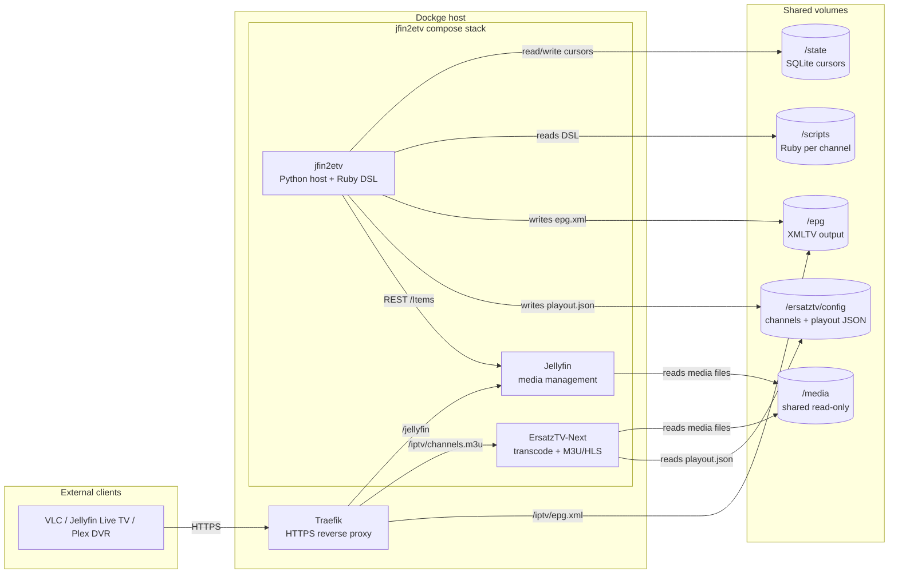
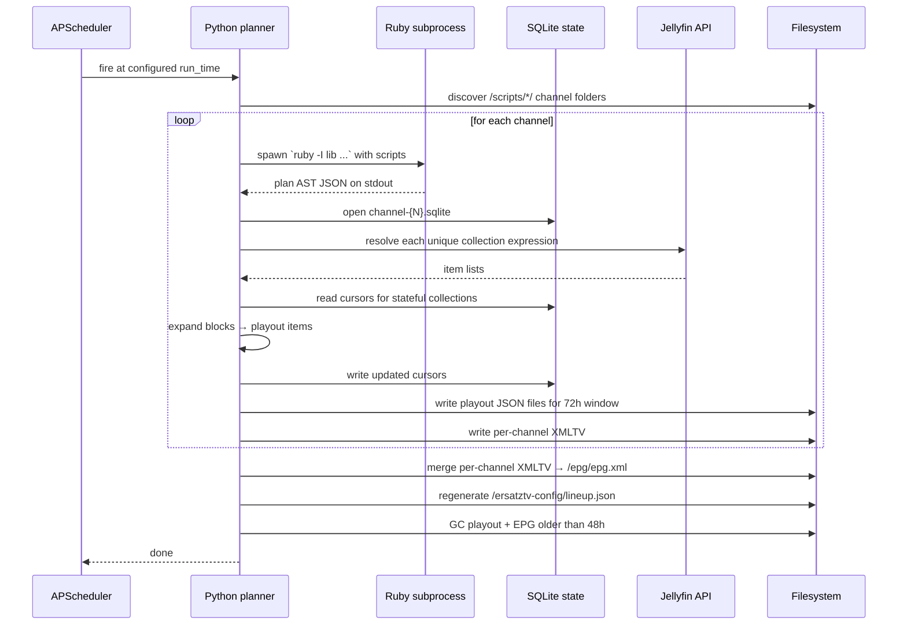

# jfin2etv — Design Document

Status: **Draft v0.2**  
Last updated: 2026-04-24  
Authors: initial spec

This document describes the design of **jfin2etv**, a scheduler that stitches together [Jellyfin](https://jellyfin.org) (media management) and [ErsatzTV-Next](https://github.com/ErsatzTV/next) (transcoding IPTV server) into a broadcast-style television stack. It is **specification-only** — no code is written against it yet. The goal is for a future contributor (or an AI agent) to be able to read this document in one sitting and understand what jfin2etv is, what it isn't, how its pieces fit together, and what still needs to be decided before implementation begins.

---

## Table of contents

1. [Purpose and non-goals](#1-purpose-and-non-goals)
2. [System context](#2-system-context)
3. [Deployment model](#3-deployment-model)
4. [Directory and volume layout](#4-directory-and-volume-layout)
5. [Ruby DSL reference](#5-ruby-dsl-reference)
6. [Ruby → host handoff protocol](#6-ruby--host-handoff-protocol)
7. [Planner / generator pipeline](#7-planner--generator-pipeline)
8. [Filler semantics](#8-filler-semantics)
9. [EPG strategy](#9-epg-strategy)
10. [Rolling window and idempotency](#10-rolling-window-and-idempotency)
11. [State management](#11-state-management)
12. [Configuration files](#12-configuration-files)
13. [CLI surface](#13-cli-surface)
14. [Observability](#14-observability)
15. [Error and failure modes](#15-error-and-failure-modes)
16. [Security](#16-security)
17. [Testing strategy](#17-testing-strategy)
18. [Worked examples](#18-worked-examples)
19. [Design decisions and deferred work](#19-design-decisions-and-deferred-work)
20. [Glossary](#20-glossary)

---

## 1. Purpose and non-goals

### 1.1 Purpose

jfin2etv is a **scheduler and playout-compiler**. Once per day, it:

1. Reads a set of **Ruby scripts**, one directory per channel, that describe what should play on each channel.
2. Queries **Jellyfin** to resolve those descriptions into concrete media items.
3. Emits **ErsatzTV-Next playout JSON** describing the next 72 hours of airtime for each channel.
4. Emits **XMLTV** (EPG) describing what each of those items is called, so clients can render a TV guide.
5. Garbage-collects anything whose finish time is more than 48 hours in the past.

The Ruby scripts use a DSL that is expressive enough to describe real broadcast-style programming — anchored time slots, pre-roll and post-roll bumpers, mid-roll breaks, "we'll be right back" / "and now back to our show" wrappers, short spacer slugs, and looping fallback fillers for gaps no real content can fill.

### 1.2 Non-goals

jfin2etv is **not**:

- A transcoder. It does not touch video bytes. ErsatzTV-Next does all transcoding and HLS segmentation. See ErsatzTV-Next's [README](../next-main/README.md): *"Library and metadata management, scheduling and playout creation are not in scope for this project."* jfin2etv fills exactly that gap.
- A media library manager. It does not scan filesystems, does not detect new files, does not manage metadata. Jellyfin does all of that.
- An HTTP server of its own. The M3U stream is served by ErsatzTV-Next; the XMLTV file is served as a static file by Traefik (or by ErsatzTV-Next's static file routes if that's added upstream).
- A replacement for legacy ErsatzTV's web UI. Configuration is code-first: Ruby scripts plus a small YAML file.
- A real-time controller. All decisions are made at planning time; once a playout file is written, jfin2etv does not second-guess it.

### 1.3 Inspirations and prior art

- **Legacy ErsatzTV** handled scheduling internally with "schedule items," a web UI, and a SQLite database. ErsatzTV-Next intentionally split those concerns out. jfin2etv is one possible scheduler for the new architecture.
- **dizqueTV** and **pseudoTV** have similar goals, but jfin2etv leans harder into broadcast television's filler-aware layout model (pre-roll, to-mid, from-mid, post-roll, slug, fallback).

---

## 2. System context

The stack consists of five containers sharing three volumes on an Ubuntu host running Dockge.



Key invariants:

- **Jellyfin and ErsatzTV-Next must agree on media paths.** The `Path` field Jellyfin returns for an item must resolve to the same file inside the ErsatzTV-Next container. This is arranged by bind-mounting the same host directory at the same path in both containers (the default), or by declaring a path-remap table in `jfin2etv.yml` (fallback).
- **jfin2etv never mutates `/media`.** It has read-only access to the shared volume purely so it can probe durations when Jellyfin's reported runtime is missing or stale.
- **EPG is served as a static file.** jfin2etv writes `/epg/epg.xml`; Traefik exposes it. ErsatzTV-Next does not care that this file exists.

---

## 3. Deployment model

### 3.1 Docker image

One image, built from a small Python base with MRI Ruby preinstalled. Dependencies are managed with [uv](https://docs.astral.sh/uv/) (fast, reproducible, lockfile-first):

```dockerfile
FROM python:3.12-slim-bookworm

RUN apt-get update && apt-get install -y --no-install-recommends \
        ruby ruby-dev ffmpeg tini ca-certificates tzdata \
    && rm -rf /var/lib/apt/lists/*

COPY --from=ghcr.io/astral-sh/uv:latest /uv /uvx /usr/local/bin/

WORKDIR /app
COPY pyproject.toml uv.lock ./
RUN uv sync --frozen --no-dev

COPY src/ ./src/
COPY lib/jfin2etv.rb /app/lib/jfin2etv.rb
COPY Gemfile Gemfile.lock ./
RUN bundle install --deployment --without development test

ENV PYTHONUNBUFFERED=1 \
    PATH="/app/.venv/bin:${PATH}"
ENTRYPOINT ["tini", "--", "jfin2etv"]
CMD ["run"]
```

`ffmpeg` is installed from Debian's apt repository — it is only used as `ffprobe` for edge cases (a bumper whose Jellyfin record is missing `RunTimeTicks`, for example). jfin2etv does **not** transcode, so ffprobe version parity with ErsatzTV-Next's bundled ffmpeg is not required. The resulting image is ~250 MB.

### 3.2 docker-compose (Dockge-compatible)

Deployment uses **two Dockge stacks** plus Traefik, which already exists in Dockge and is not redeclared here. Jellyfin runs alone so it can be managed, updated, and backed up independently (it is the long-lived, stateful piece of the stack). ErsatzTV-Next and jfin2etv share a stack because they share the `/ersatztv-config` volume and are tightly coupled in practice.

All three services join a single external Docker network, `media_proxy`, created once on the host with `docker network create media_proxy`. Traefik joins the same network. Within the network, containers address each other by service name: jfin2etv reaches Jellyfin at `http://jellyfin:8096` regardless of which stack it lives in.

#### Stack 1 — `stacks/jellyfin/compose.yml`

```yaml
services:
  jellyfin:
    image: jellyfin/jellyfin:latest
    restart: unless-stopped
    volumes:
      - ./config:/config
      - ./cache:/cache
      - /srv/media:/media:ro
    networks: [media_proxy]
    labels:
      - traefik.enable=true
      - traefik.docker.network=media_proxy
      - traefik.http.routers.jellyfin.rule=Host(`jellyfin.example.com`)
      - traefik.http.routers.jellyfin.tls.certresolver=le
      - traefik.http.services.jellyfin.loadbalancer.server.port=8096

networks:
  media_proxy:
    external: true
```

#### Stack 2 — `stacks/jfin2etv/compose.yml`

```yaml
services:
  ersatztv:
    image: ghcr.io/ersatztv/next:latest
    restart: unless-stopped
    volumes:
      - ./ersatztv/config:/config
      - /srv/media:/media:ro
    command: ["/config/lineup.json"]
    networks: [media_proxy]
    labels:
      - traefik.enable=true
      - traefik.docker.network=media_proxy
      - traefik.http.routers.etv.rule=Host(`tv.example.com`)
      - traefik.http.routers.etv.tls.certresolver=le
      - traefik.http.services.etv.loadbalancer.server.port=8409

  jfin2etv:
    image: ghcr.io/<you>/jfin2etv:latest
    restart: unless-stopped
    environment:
      JELLYFIN_URL: http://jellyfin:8096
      JELLYFIN_API_KEY: ${JELLYFIN_API_KEY}
      TZ: America/New_York
    volumes:
      - ./jfin2etv/config:/config
      - ./jfin2etv/scripts:/scripts
      - ./jfin2etv/state:/state
      - ./jfin2etv/epg:/epg
      - ./ersatztv/config:/ersatztv-config      # shared with ersatztv above
      - /srv/media:/media:ro
    depends_on: [ersatztv]
    networks: [media_proxy]
    labels:
      # static XMLTV served straight off the volume by Traefik via jfin2etv's
      # small static-file server on port 8080 (see §14.3).
      - traefik.enable=true
      - traefik.docker.network=media_proxy
      - traefik.http.routers.epg.rule=Host(`tv.example.com`) && PathPrefix(`/epg`)
      - traefik.http.routers.epg.tls.certresolver=le
      - traefik.http.services.epg.loadbalancer.server.port=8080

networks:
  media_proxy:
    external: true
```

Notes:

- `depends_on: [ersatztv]` is a soft startup ordering hint only; jfin2etv tolerates ErsatzTV-Next being down (it still writes playout JSON files, which the server will pick up when it starts).
- jfin2etv does **not** `depends_on` Jellyfin because Jellyfin is in a different stack. Instead, the runtime handles Jellyfin being unreachable gracefully (see §15).
- The host directory `/srv/media` is the shared read-only media root. Both Jellyfin and ErsatzTV-Next must see the same absolute paths inside their containers — `/media` is the convention.

### 3.3 Environment variables

| Variable | Required | Purpose |
|---|---|---|
| `JELLYFIN_URL` | yes | Base URL Jellyfin is reachable at from the jfin2etv container. |
| `JELLYFIN_API_KEY` | yes | API key with read access to all libraries to be scheduled. |
| `TZ` | yes | IANA timezone; used for anchored schedule times and XMLTV output. |
| `JFIN2ETV_CONFIG` | no | Path to `jfin2etv.yml`. Default: `/config/jfin2etv.yml`. |
| `JFIN2ETV_LOG_LEVEL` | no | `debug`, `info`, `warning`, `error`. Default: `info`. |

---

## 4. Directory and volume layout

Canonical in-container paths:

```
/config/
  jfin2etv.yml                   # host config (see section 12)

/scripts/
  01/
    main.rb                      # channel 01 DSL
  02/
    main.rb
    fillers.rb                   # scripts may be split; all .rb in a channel folder are evaluated together
  03/
    main.rb

/state/
  channel-01.sqlite              # per-channel state (see section 11)
  channel-02.sqlite
  channel-03.sqlite

/ersatztv-config/                # shared with ErsatzTV-Next container
  lineup.json                    # maintained by jfin2etv (channel list is derived from /scripts)
  channels/
    01/
      channel.json               # maintained by user; jfin2etv does not overwrite
      playout/
        20260424T000000.000000000-0500_20260425T000000.000000000-0500.json
        20260425T000000.000000000-0500_20260426T000000.000000000-0500.json
        20260426T000000.000000000-0500_20260427T000000.000000000-0500.json
    02/
      channel.json
      playout/...
    03/
      channel.json
      playout/...

/epg/
  epg.xml                        # combined XMLTV for all channels (what Traefik serves)
  per-channel/
    01.xml
    02.xml
    03.xml

/media/                          # read-only, shared with Jellyfin & ErsatzTV-Next
  ...
```

### 4.1 Reconciling script folders with ErsatzTV-Next folders

You asked for `/scripts/01/`, `/scripts/02/`, etc. ErsatzTV-Next wants `config/channels/{N}/playout/`. jfin2etv treats the `/scripts/{N}/` folder name as **canonical channel number** and derives the ErsatzTV-Next output path from it: `/ersatztv-config/channels/{N}/playout/`. No symlinks needed; jfin2etv writes directly into the ErsatzTV-Next config tree.

The leading-zero channel number is preserved verbatim in both locations and in the XMLTV `channel[@id]` attribute — ErsatzTV-Next's own [schema](../next-main/schema/lineup_config.json) documents `number` as a string, so `"01"` is valid.

### 4.2 `channel.json` and `lineup.json` ownership

Both files under `/ersatztv-config/` are **owned by jfin2etv** and regenerated on every run. The Ruby DSL is the single source of truth; no hand-editing in JSON.

- **`lineup.json`** (top-level ErsatzTV-Next config: server bind address, output folder, the list of channels) is rewritten each run from the set of folders under `/scripts/` and the settings in [`jfin2etv.yml`](#121-jfin2etvyml).
- **`channel.json`** (per-channel transcode/normalization settings: codec, resolution, bitrate, hardware acceleration, audio loudness targets) is generated from the `transcode:` hash on each channel's `channel(...)` declaration (see §5.1). Channels that omit `transcode:` get a sensible default.

The operator should treat everything under `/ersatztv-config/` as a build artifact — edits there are clobbered on the next run. Per-channel tuning lives in the Ruby script; stack-wide defaults live in `jfin2etv.yml`.

---

## 5. Ruby DSL reference

This section describes every DSL verb. The DSL is implemented as a Ruby library (`/app/lib/jfin2etv.rb`) that is `require`d implicitly at the top of every channel script. Scripts are free to use the full Ruby language around the DSL — loops, conditionals, `each`, `map`, `Date.today.wday`, etc.

### 5.1 `channel`

Declares channel metadata, including the transcode settings that jfin2etv writes into `channel.json` for ErsatzTV-Next. Exactly one per script directory.

```ruby
channel(
  number: "01",
  name:   "Classic Rock Videos",
  tuning: "01.1",                                 # optional; defaults to number
  icon:   "/media/logos/classicrock.png",         # optional; path or http URL
  language: "en",                                 # optional; default "en"
  transcode: {
    ffmpeg: {
      ffmpeg_path:       "/usr/bin/ffmpeg",
      ffprobe_path:      "/usr/bin/ffprobe",
      disabled_filters:  [],
      preferred_filters: []
    },
    video: {
      format:            :hevc,                   # :h264 | :hevc
      width:             1920,
      height:            1080,
      bitrate_kbps:      6000,
      buffer_kbps:       12000,
      bit_depth:         8,
      accel:             :vaapi,                  # :cuda | :qsv | :vaapi | :videotoolbox | :vulkan | nil
      deinterlace:       false,
      tonemap_algorithm: nil,
      vaapi_device:      "/dev/dri/renderD128",
      vaapi_driver:      :ihd                     # :ihd | :i965 | :radeonsi
    },
    audio: {
      format:            :aac,                    # :aac | :ac3
      bitrate_kbps:      192,
      buffer_kbps:       384,
      channels:          2,
      sample_rate_hz:    48000,
      normalize_loudness: true,
      loudness: {
        integrated_target: -23.0,
        range_target:      7.0,
        true_peak:         -2.0
      }
    },
    playout: {
      virtual_start: nil                          # optional RFC3339 start time
    }
  }
)
```

#### Transcode hash schema

The `transcode:` hash mirrors ErsatzTV-Next's [`channel_config.json`](../next-main/schema/channel_config.json) one-for-one. Sub-hashes and field names match the schema exactly; Ruby symbols are translated to the schema's string enums at emission time (`:hevc` → `"hevc"`, `:vaapi` → `"vaapi"`, etc.). The `playout.folder` field is injected by jfin2etv and is not user-settable (it's always `/config/channels/{N}/playout/` inside the ErsatzTV-Next container).

#### Defaults

A `channel(...)` declaration that omits `transcode:` gets this default, which produces a valid 1080p H.264 channel on any host with CPU-only ffmpeg:

```ruby
transcode: {
  ffmpeg: { ffmpeg_path: "ffmpeg", ffprobe_path: "ffprobe" },
  video:  { format: :h264, width: 1920, height: 1080,
            bitrate_kbps: 4000, buffer_kbps: 8000, bit_depth: 8,
            accel: nil, deinterlace: false },
  audio:  { format: :aac, bitrate_kbps: 160, buffer_kbps: 320,
            channels: 2, sample_rate_hz: 48000, normalize_loudness: false }
}
```

A partial `transcode:` (e.g. only `{ video: { accel: :cuda } }`) is deep-merged with the defaults — the operator only has to specify fields they want to override. Defaults may be re-tuned in later versions as hardware profiles shift; scripts that hard-code every field are insulated from that.

#### Validation

Validation runs at plan time, before any Jellyfin calls:

- Unknown top-level keys under `transcode:` (anything other than `:ffmpeg`, `:video`, `:audio`, `:playout`) raise a DSL error.
- Unknown keys under each sub-hash raise a DSL error naming the offending key and path.
- Enum-valued fields (`video.format`, `video.accel`, `video.vaapi_driver`, `audio.format`) validate against their schema enums; an unknown symbol raises a DSL error listing the allowed values.
- `video.format`, `video.width`, `video.height`, `audio.format`, `audio.channels` are required (either explicitly or from the default merge) — a partial override that blanks them out is rejected.

DSL errors abort the channel's run for this tick (the channel's previous playout files remain per §10.2's immutability rule) and surface as `channel.plan_failed` events.

### 5.2 `collection`

Defines a named pool of media drawn from Jellyfin by a query expression. See [section 5.8](#58-jellyfin-query-expression-grammar) for the expression grammar.

```ruby
collection :rock_videos,
  "type:music_video AND genre:Rock",
  mode: :shuffle

collection :simpsons,
  %q{series:"The Simpsons"},
  mode: :sequential,
  sort: :episode                    # field to order by when mode is :sequential/:chronological

collection :short_cartoons,
  "type:movie AND genre:Animation AND runtime:<00:15:00",
  mode: :random_with_memory,
  memory_window: 30                 # don't replay within the last 30 picks

collection :weighted_videos,
  "type:music_video AND tag:weighted_pool",
  mode: :weighted_random,
  weight_field: "CommunityRating"   # higher rating = more likely to play
```

#### Playback modes

| Mode | Stateful? | Behaviour |
|---|---|---|
| `:shuffle` | no | Uniform random without replacement within a generator run. Fresh permutation each run. |
| `:sequential` | yes | Plays items in a user-specified sort order; cursor persists across runs. On reaching the end, wraps to the beginning. |
| `:chronological` | yes | Same as `:sequential` but the sort is fixed to `PremiereDate` ascending. Shorthand for common use. |
| `:random_with_memory` | yes | Random, but avoids replaying any of the last N picks (`memory_window`). Remembers across runs. |
| `:weighted_random` | no | Probability ∝ `weight_field`. Stateless. |

### 5.3 `filler`

Defines a named filler pool. Fillers are the machinery that turn a raw list of main content into real-looking broadcast TV. jfin2etv supports seven kinds:

| Kind | When it plays | Typical content |
|---|---|---|
| `:slug` | Between every two items in a block (configurable per layout) | Short black-frame clip, e.g. 0.5s–2s |
| `:pre_roll` | Just before the main item in a block | Channel ident, "next up" bumper |
| `:post_roll` | Just after the main item | "Thanks for watching" bumper |
| `:mid_roll` | Inserted at chapter boundaries of a main item that has `ChapterInfo` in Jellyfin | Commercials |
| `:to_mid` | Just before a mid-roll | "We'll be right back" |
| `:from_mid` | Just after a mid-roll | "And now back to our show" |
| `:fallback` | Looped (and trimmed) to fill any leftover time between the end of an item chain and the next anchored block | Station ident loops, color bars, silent filler |

Syntax:

```ruby
filler :slug,      local: "/media/bumpers/black_2s.mkv"
filler :pre_roll,  collection: "type:bumper AND tag:classic_rock_preroll"
filler :post_roll, collection: "type:bumper AND tag:channel_outro", mode: :shuffle
filler :mid_roll,  collection: "type:commercial AND decade:1990", mode: :random_with_memory
filler :to_mid,    local: "/media/bumpers/brb.mkv"
filler :from_mid,  local: "/media/bumpers/back.mkv"
filler :fallback,  collection: "type:filler AND tag:station_ident", mode: :shuffle
```

A filler may be either a single `local:` file or a full `collection:` expression (including `mode:`). Single files are never shuffled; collections are drawn per their mode.

If a given filler kind is **not defined**, the layout step that uses it becomes a no-op. A layout that tries to use `:mid_roll` when no `:mid_roll` filler is defined logs a warning once per run and continues.

### 5.4 `layout`

A layout is a reusable template describing how a single block is built. A block is: zero or more pre-roll items, the main content, optional mid-roll groups, zero or more post-roll items, and a fallback tail.

```ruby
layout :classic_show do
  pre_roll  count: 1                      # play 1 pre-roll clip (drawn from :pre_roll filler pool)
  main                                    # the collection's items go here
  mid_roll  every: :chapter,              # insert at each chapter boundary
            wrap_with: [:to_mid, :from_mid],
            count: 2                      # 2 commercials per break; use :auto to flex (see 5.5)
  post_roll count: 1
  slug      between_items: true, duration: 1.0   # 1.0s black slug between every pair of main items
  fill      with: [:mid_roll, :fallback]  # prefer commercials as padding; fallback is last resort
  epg       granularity: :per_item,       # one EPG programme per main item
            title:       :from_main,
            description: :from_main
end
```

#### Layout blocks

| Verb | Purpose |
|---|---|
| `pre_roll count: N` | Play N items from the `:pre_roll` pool before main. Defaults to 0. |
| `main` | Marker for where the collection's items go. If omitted, the layout is filler-only. |
| `mid_roll every:, wrap_with:, count:, per_break_target:` | Insert mid-roll groups. `every:` may be `:chapter`, `:minutes => 15`, or `:never`. `wrap_with:` optionally sandwiches the group between `:to_mid` and `:from_mid`. `count:` is the number of items per group, or `:auto` to flex based on the block's `align:` target (see 5.5). `per_break_target:` is the soft target duration in seconds for each auto-counted break (default 120). |
| `post_roll count: N` | Play N items from `:post_roll` after main. |
| `slug between_items: true, duration: 1.0` | Insert a `:slug` filler between every pair of items (including between pre/main/post). `duration:` overrides the filler's natural length (clip is trimmed or looped). |
| `fill with: <pool or list>` | Pad to the target end (next anchored block, or alignment target — see 5.5). Accepts a single filler name like `:fallback`, or an ordered list like `[:mid_roll, :fallback]` where earlier pools are preferred and later pools are only drawn from when the remaining gap can't accommodate a whole item from the earlier pool. The final item is always trimmed with `out_point_ms` to land exactly on the target. |
| `epg granularity:, title:, description:, category:` | How this block projects into XMLTV. See [section 9](#9-epg-strategy). |

#### EPG granularity modes

- `:per_item` — one `<programme>` per main item (classic "TV series guide" look).
- `:per_block` — one `<programme>` for the whole block, spanning from anchored start to next anchored start. Overrides title/description from the block's `schedule` entry.
- `:per_chapter` — one `<programme>` per chapter of the main item (useful for anthology episodes).

#### Title/description sources

- `:from_main` — use the main item's Jellyfin metadata (series + episode title for episodes; title for movies; artist+track for music videos).
- `:from_series` — series name only; useful for per-block display.
- `"literal string"` — static override.
- A Ruby proc — computed per-item, receiving the Jellyfin item as a hash.

### 5.5 `schedule`

Lays out the 24-hour wall-clock schedule using **anchored blocks**. Every block has an explicit `at:` time; jfin2etv sorts them, and each block's gap is the time from its `at:` to the next block's `at:` (wrapping at 24:00).

```ruby
schedule do
  block at: "06:00", collection: :simpsons,       layout: :classic_show, align: 30.minutes
  block at: "07:00", collection: :rock_videos,    layout: :music_video_block
  block at: "08:00", collection: :short_cartoons, layout: :saturday_morning, count: 6,
                     epg: { title: "Saturday Morning Cartoons" }
  block at: "12:00", collection: :simpsons,       layout: :classic_show, align: 30.minutes
  block at: "20:00", collection: :simpsons,       layout: :classic_show, align: 30.minutes

  default_block collection: :rock_videos, layout: :music_video_block
end
```

#### `block` keyword arguments

| Arg | Required | Purpose |
|---|---|---|
| `at:` | yes | Wall-clock time (24-hour, `HH:MM` or `HH:MM:SS`) in the channel's timezone. |
| `collection:` | yes | Symbol naming a declared collection. |
| `layout:` | yes | Symbol naming a declared layout. |
| `count:` | no | Max number of main items to draw from the collection. If omitted, jfin2etv draws items until the gap is filled (main + layout overhead). |
| `on:` | no | Day-of-week restriction: `:weekdays`, `:weekends`, `:monday`, `[:mon, :wed]`, a `Range` of dates, or a `Proc` taking a `Date`. Blocks whose `on:` does not match are skipped for that day (and the previous matching block's fallback fills the gap). |
| `align:` | no | Snap the block's target end time to a clock-friendly boundary, expressed as a `Duration` (e.g. `30.minutes`, `15.minutes`, `1.hour`). The target end is `ceil_to_next(natural_end, align)` anchored to the top of the hour, subject to not exceeding the next anchored block's `at:`. See "Block alignment and flexible padding" below. |
| `epg:` | no | Per-block EPG overrides: `{ title: "...", description: "...", category: "..." }`. |
| `variants:` | no | A map `{ <key> => { collection:, layout: } }` of alternative configurations. Requires a matching `variant:` selector. See [5.5.1](#551-block-variants). |
| `variant:` | no | Selector for `variants:`. Either a day-of-week hash (`{ weekdays: :sitcoms, weekends: :movies }`) or a `Proc` taking a `Date` and returning a Symbol. See [5.5.1](#551-block-variants). |

#### `default_block`

If the schedule has a gap longer than X hours (default 1h, configurable in `jfin2etv.yml`) with no anchored block, the `default_block` is used to fill. Think of it as the "dead of night" filler. At most one `default_block` per schedule.

#### Gaps, wrap, and precedence

- The schedule wraps at 24:00. A block at `23:00` with no later block fills until the `06:00` block on the next day.
- Blocks are sorted by `at:` before expansion. Duplicate anchor times raise a DSL error at evaluation time.
- A block whose computed end time is earlier than its `at:` (e.g. you declared `at: "25:00"`) raises a DSL error.

#### Block alignment and flexible padding

Broadcast television doesn't just run a show until it ends — it runs the show plus commercials plus bumpers until the total duration hits a clock-friendly boundary (a half-hour, an hour). jfin2etv expresses this pattern with three composable pieces:

1. **`align:` on the block (or on the schedule's `default_block`)** — declares the target clock boundary. `align: 30.minutes` means "this block's end must land on the next `:00` or `:30` mark after the main item finishes, unless the next anchored block comes first." `align: 1.hour` snaps to the next top-of-the-hour. The alignment is anchored to the top of the current hour, not to the block's `at:`, so `align: 30.minutes` always means the `:00`/`:30` grid regardless of when the block started.
2. **`mid_roll count: :auto` (with optional `per_break_target:`)** — distributes a computed total commercial budget across all chapter (or minute-mark) breaks. The budget is `align_target - main_duration - pre_roll_duration - post_roll_duration - num_breaks × (to_mid + from_mid)`. jfin2etv packs each break to at least `per_break_target` seconds (default 120), balancing across breaks so no single one is grotesquely long.
3. **`fill with: [:mid_roll, :fallback]`** — the layout's tail-padding step can draw from multiple pools in priority order. jfin2etv tries to absorb leftover slack with the first pool; only when the remaining gap is smaller than the shortest available item in the first pool does it fall through to the next. Because `:fallback`'s final item is always trimmed to land exactly on the target, this guarantees a clean boundary without drift.

Together these produce real-TV behaviour: a 22-minute sitcom in a 30-minute block gets ~8 minutes of commercials distributed across chapter breaks, with the `:fallback` pool essentially never touched.

Edge cases:

- **Main item is longer than the alignment target.** `align:` always rounds **up**, so a 35-minute episode with `align: 30.minutes` produces a 60-minute block. jfin2etv emits an `info` log event recording the expansion.
- **Next anchored block would start before the alignment target.** The next anchored block always wins; the alignment target is capped at that time. No block ever overruns its successor.
- **Main item has no chapters (for `every: :chapter`).** No mid-roll groups fire; all commercial slack has to flow through the `fill` step. With `fill with: [:mid_roll, :fallback]` this gracefully becomes a single long tail-break after the show instead of chapter-spaced breaks.
- **Budget is negative.** If `main + required filler` already exceeds `align_target`, jfin2etv rounds the target up to the next multiple of `align:` and logs the expansion. The block never silently truncates the main item.
- **`count: :auto` with no `align:` set.** Falls back to `count: 1` per break and emits a DSL warning the first time it's encountered — auto-count only makes sense with a known target end.

The three features are independent. You can use `align:` with fixed-count mid-rolls (then `fill` absorbs the slack). You can use `count: :auto` without `align:` if you just want mid-rolls to expand to fill the gap to the next anchored block. You can use `fill with: [:mid_roll, :fallback]` without either of the others when you just want better-looking padding.

#### 5.5.1 Block variants

A block with `variants:` declares alternative configurations selected at plan time by the block's `variant:` selector. A variant may override **only** the block's `collection:` and `layout:`; every other field (`at:`, `count:`, `align:`, `on:`, `epg:`) is fixed by the outer block. This keeps the guide's wall-clock grid stable regardless of which variant is active.

```ruby
# Hash selector — day-of-week → variant key
block at: "20:00",
      align: 30.minutes,
      count: 1,
      collection: :simpsons,          # default, used if selector returns a key not in variants
      layout:     :sitcom_block,
      variants: {
        weekdays: { collection: :simpsons,    layout: :sitcom_block },
        weekends: { collection: :movie_pool,  layout: :movie_night  }
      },
      variant: { weekdays: :weekdays, weekends: :weekends }

# Proc selector — arbitrary logic, receives a Date in the channel's TZ
block at: "12:00",
      collection: :lunchtime_news,
      layout:     :news_block,
      variants: {
        standard: { collection: :lunchtime_news, layout: :news_block },
        holiday:  { collection: :holiday_reel,   layout: :movie_night }
      },
      variant: ->(d) { HOLIDAYS.include?(d) ? :holiday : :standard }
```

##### Selector keys accepted by the hash form

- Symbolic days: `:mon`, `:tue`, `:wed`, `:thu`, `:fri`, `:sat`, `:sun`
- Aliases: `:weekdays` (Mon–Fri), `:weekends` (Sat–Sun)
- `:default` — used when no more specific key matches

Resolution order: exact day symbol > `:weekdays`/`:weekends` > `:default`. A hash that maps no key to the date being planned and has no `:default` raises a DSL error at plan time.

##### Semantics

- The selector is evaluated once per day-in-window, per block. A single block that runs across multiple days in the 72-hour window may resolve to different variants on different days.
- The value returned by the selector is a symbol used as a key into the `variants:` map.
- An unknown variant key raises a DSL error at plan time (listing the missing key and the block's `at:`).
- A variant entry may omit `collection:` or `layout:`, in which case the block's top-level value is used. It may not introduce keys other than `:collection` and `:layout` — those raise a DSL error.
- `on:` filtering is applied **before** variant resolution. A block skipped by `on:` is skipped entirely; variants do not rescue it.

##### Non-goals for v1

A variant cannot swap filler pools, EPG overrides, counts, or alignment. Those are block-level properties. The typical escape hatch is to declare two separate blocks with distinct `on:` clauses instead of using `variants:`; `variants:` is for the narrower case of "same slot, same guide entry shape, different content on different days."

### 5.6 DSL-level helpers

The DSL library exposes a few helpers for use inside scripts:

```ruby
local(path)                 # shorthand for a single-file source
http(uri, headers: [...])   # shorthand for an http source (for collections that point at external URLs)
today                       # Date.today in channel timezone
weekday?                    # bool
env(name, default: nil)     # read an env var (meant for non-secret values)
```

### 5.7 Full script skeleton

```ruby
# /scripts/01/main.rb

channel number: "01", name: "Classic Rock Videos"

# collections
collection :rock_videos, "type:music_video AND genre:Rock", mode: :shuffle

# fillers
filler :slug,     local: "/media/bumpers/black_1s.mkv"
filler :pre_roll, collection: "type:bumper AND tag:classicrock_pre"
filler :fallback, collection: "type:bumper AND tag:classicrock_fill", mode: :shuffle

# layouts
layout :video_block do
  pre_roll count: 1
  main
  slug     between_items: true
  fill     with: :fallback
  epg      granularity: :per_item, title: :from_main
end

# schedule
schedule do
  block at: "00:00", collection: :rock_videos, layout: :video_block
  default_block collection: :rock_videos, layout: :video_block
end
```

### 5.8 Jellyfin query expression grammar

The string passed to `collection` / `filler`-`collection:` is a small boolean expression that compiles to one or more [Jellyfin `/Items` API](https://api.jellyfin.org) queries plus a client-side filter.

```
expr    := term ( ( "AND" | "OR" ) term )*
         | "NOT" term
term    := "(" expr ")" | atom
atom    := field ":" value
field   := "type" | "genre" | "tag" | "series" | "studio" | "year"
         | "runtime" | "collection" | "library" | "rating" | "person"
value   := literal | quoted | range | comparison
literal := /[A-Za-z0-9_.-]+/
quoted  := '"..."'          (supports spaces; escape " as \")
range   := /\d+\.\.\d+/     (e.g. 1990..1999 for year)
comparison := "<" duration | ">" duration | "<=" duration | ">=" duration
             (for runtime only; duration is HH:MM:SS or PTxx notation)
```

#### Field-to-Jellyfin mappings

| DSL field | Jellyfin param | Notes |
|---|---|---|
| `type:movie` | `IncludeItemTypes=Movie` | Valid types: `movie`, `episode`, `series`, `music_video`, `audio`, `bumper`, `commercial`, `filler`, `trailer`. Aliased to the right Jellyfin type. |
| `genre:Rock` | `Genres=Rock` | Case-insensitive match. |
| `tag:preroll` | `Tags=preroll` | Case-insensitive. |
| `series:"The Simpsons"` | Resolved to `SeriesId` via `/Items?SearchTerm=...&IncludeItemTypes=Series` then `ParentId` | |
| `studio:"HBO"` | `Studios=HBO` | |
| `year:1990` | `Years=1990` | |
| `year:1990..1999` | `Years=1990,1991,...,1999` | Expanded client-side. |
| `runtime:<00:15:00` | `MaxRuntimeTicks=9000000000` | 1 tick = 100 ns. Jellyfin supports min/max ticks. |
| `collection:"Movies I Like"` | Resolved to `ParentId` via `/Items?IncludeItemTypes=BoxSet` | |
| `library:"Cartoons"` | Resolved to library `ParentId` | |
| `rating:>7.5` | Client-side filter on `CommunityRating`. | |
| `person:"Homer Simpson"` | `PersonIds=...` via lookup | |

#### Boolean semantics

- `AND` → intersection of item sets (fetch each atom, intersect by `Id`).
- `OR` → union.
- `NOT term` → all items in the channel's configured libraries, minus the term's set. Requires a bounding `library:` or `collection:` field elsewhere in the expression, else jfin2etv raises an error (unbounded NOT is dangerous).
- Parentheses group. Operator precedence: `NOT` > `AND` > `OR`.

#### Query caching

Each unique expression is hashed and cached for the duration of a single generator run — two collections using the same expression only cost one round-trip.

---

## 6. Ruby → host handoff protocol

The Ruby DSL does not perform any I/O — it builds an in-memory plan AST and prints it as JSON to stdout. The Python host consumes that JSON, then does the Jellyfin queries, state lookup, playout compilation, and file writes.

This separation keeps the DSL deterministic and testable, and means Ruby scripts never need network access or secrets.

### 6.1 Invocation

For each channel folder `N` under `/scripts/`:

```
ruby -I /app/lib \
     -r jfin2etv/runner \
     -e 'Jfin2etv::Runner.run(Dir["/scripts/N/*.rb"].sort, channel: "N")'
```

The runner:

1. Switches `$stdout` to a `StringIO` and redirects any script `puts` to `$stderr`.
2. `load`s each script in order. All DSL verbs populate a `Jfin2etv::Plan` singleton.
3. When all scripts have loaded, serializes the plan to JSON and prints it to the real stdout.
4. Exits `0` on success, `2` on DSL validation error, `1` on any other uncaught exception.

### 6.2 Plan AST schema (v1)

Emitted as a single JSON document:

```json
{
  "schema_version": "jfin2etv-plan/1",
  "channel": {
    "number": "01",
    "name": "Classic Rock Videos",
    "tuning": "01.1",
    "icon": "/media/logos/classicrock.png",
    "language": "en",
    "transcode": {
      "ffmpeg": {
        "ffmpeg_path":       "/usr/bin/ffmpeg",
        "ffprobe_path":      "/usr/bin/ffprobe",
        "disabled_filters":  [],
        "preferred_filters": []
      },
      "video": {
        "format":            "hevc",
        "width":             1920,
        "height":            1080,
        "bitrate_kbps":      6000,
        "buffer_kbps":       12000,
        "bit_depth":         8,
        "accel":             "vaapi",
        "deinterlace":       false,
        "tonemap_algorithm": null,
        "vaapi_device":      "/dev/dri/renderD128",
        "vaapi_driver":      "ihd"
      },
      "audio": {
        "format":             "aac",
        "bitrate_kbps":       192,
        "buffer_kbps":        384,
        "channels":           2,
        "sample_rate_hz":     48000,
        "normalize_loudness": true,
        "loudness": {
          "integrated_target": -23.0,
          "range_target":       7.0,
          "true_peak":         -2.0
        }
      },
      "playout": { "virtual_start": null }
    }
  },
  "collections": {
    "rock_videos": {
      "expression": "type:music_video AND genre:Rock",
      "mode": "shuffle",
      "sort": null,
      "memory_window": null,
      "weight_field": null
    }
  },
  "fillers": {
    "slug":     { "kind": "local",      "path": "/media/bumpers/black_1s.mkv" },
    "pre_roll": { "kind": "collection", "expression": "type:bumper AND tag:classicrock_pre", "mode": "shuffle" },
    "fallback": { "kind": "collection", "expression": "type:bumper AND tag:classicrock_fill", "mode": "shuffle" }
  },
  "layouts": {
    "video_block": {
      "steps": [
        { "op": "pre_roll",  "count": 1 },
        { "op": "main" },
        { "op": "slug",      "between_items": true, "duration": null },
        { "op": "fill",      "with": "fallback" }
      ],
      "epg": {
        "granularity": "per_item",
        "title": "from_main",
        "description": null,
        "category": null
      }
    }
  },
  "schedule": {
    "blocks": [
      {
        "at": "00:00",
        "collection": "rock_videos",
        "layout": "video_block",
        "count": null,
        "on": null,
        "align_seconds": null,
        "epg_overrides": null,
        "variants": null,
        "variant_selector": null
      },
      {
        "at": "20:00",
        "collection": "simpsons",
        "layout": "sitcom_block",
        "count": 1,
        "align_seconds": 1800,
        "on": null,
        "epg_overrides": null,
        "variants": {
          "weekdays": { "collection": "simpsons",   "layout": "sitcom_block" },
          "weekends": { "collection": "movie_pool", "layout": "movie_night" }
        },
        "variant_selector": {
          "type": "dow",
          "table": { "weekdays": "weekdays", "weekends": "weekends" }
        }
      }
    ],
    "default_block": {
      "collection": "rock_videos",
      "layout": "video_block"
    }
  }
}
```

#### Variant selector serialization

The `variant_selector` field is one of:

- `{ "type": "dow", "table": { "<dow_key>": "<variant_key>", ... } }` — emitted by the hash form. The `table` preserves the user's map verbatim (including `:default` and specific day keys), normalized to string keys.
- `{ "type": "proc", "source": "<ruby source snippet>" }` — emitted by the Proc form. The runner captures the proc's source via `MethodSource` or equivalent; the Python host re-evaluates the proc in the Ruby runner once per day-in-window by calling back into a small Ruby helper (`ruby -I /app/lib -r jfin2etv/selector -e "..."`) with the date as a string argument. This keeps Ruby the sole authority on Ruby code; Python never parses Ruby.

If the Ruby source capture fails (rare — happens when a proc is built from `eval` at runtime), the runner raises a DSL error at plan emission time.

#### Transcode object

`channel.transcode` mirrors ErsatzTV-Next's [`channel_config.json`](../next-main/schema/channel_config.json) exactly. Enum fields are lowercase strings; unspecified optional fields are `null`. The `playout.folder` key is **not** present in the plan AST — the Python host injects it when rendering `channel.json` for the specific container path.

### 6.3 Error model

| Condition | Exit code | Stderr format |
|---|---|---|
| Ruby syntax error in a script | 1 | Normal Ruby backtrace. |
| DSL validation error (duplicate anchor, unknown layout referenced by block, unbounded NOT, etc.) | 2 | `jfin2etv: DSL error in <file>:<line>: <message>`. |
| Uncaught exception | 1 | Normal Ruby backtrace. |
| Success | 0 | (nothing on stderr except script `puts`/`warn`) |

The Python host surfaces stderr verbatim in its logs so users see Ruby tracebacks without having to run Ruby manually.

### 6.4 Validation-only mode

`jfin2etv validate` invokes the Ruby runner with a `VALIDATE_ONLY=1` env var. The runner performs full DSL parsing but does **not** print the plan; it just exits `0` or `2`. This lets CI lint scripts without needing a running Jellyfin.

---

## 7. Planner / generator pipeline

The daily run, in full, for a single channel:



### 7.1 Step-by-step

1. **Discover channels.** List `/scripts/*/` and select subdirectories whose name matches `/^\d+$/`. Sort ascending.
2. **Evaluate plan.** For each channel, spawn the Ruby runner. Capture stdout (JSON) and stderr (logs). Timeout: 30s per channel.
3. **Resolve Jellyfin queries.** Parse each unique expression in the plan. For each, build the set of matching items (see section 5.8). Cache by expression hash for the run.
4. **Load state.** Open `/state/channel-{N}.sqlite`. Fetch cursors for all stateful collections in this plan.
5. **Compute window.** `window_start = floor_to_day(now)`; `window_end = window_start + 72h`. Timezone is the channel's `TZ` env var.
6. **For each 24h day in the window:**
   1. Check if `{day_start}_{day_end}.json` already exists in the channel's `playout/` folder. If so, skip (immutability rule, section 10).
   2. Expand all blocks for that day into playout items (section 8).
   3. Write the playout file atomically (write to `.tmp`, `fsync`, rename).
   4. Append per-day programmes to the channel's XMLTV buffer.
7. **Persist state.** Write updated cursors back to SQLite in a single transaction.
8. **Write XMLTV.** Serialize the channel's XMLTV to `/epg/per-channel/{N}.xml`.
9. **Merge.** After all channels are done, concatenate per-channel XMLTV into `/epg/epg.xml` with a single root `<tv>` element.
10. **Regenerate lineup.** Write `/ersatztv-config/lineup.json` listing all discovered channels.
11. **GC.** Remove any playout JSON whose filename encodes a `finish` timestamp more than 48h before `now`. Remove equivalent XMLTV entries (by `stop` attribute).

### 7.2 Block expansion state machine

```mermaid
stateDiagram-v2
    [*] --> Init
    Init: set t := block.at (as datetime in channel TZ)
    Init --> PreRoll

    PreRoll: emit layout.pre_roll items (drawn from :pre_roll pool)
    PreRoll --> MainItem: layout has `main`
    PreRoll --> Fill: layout has no `main` (filler-only block)

    MainItem: pick next item from collection (mode-aware)
    MainItem --> MidRoll: layout.mid_roll.every fires
    MainItem --> Slug: layout.slug.between_items && more main items remain
    MainItem --> PostRoll: main exhausted OR count limit hit OR gap-remaining < next-item-duration

    Slug --> MainItem

    MidRoll: emit :to_mid (if set), mid_roll items, :from_mid (if set)
    MidRoll --> MainItem: resume inside same item from chapter boundary

    PostRoll: emit layout.post_roll items
    PostRoll --> Fill

    Fill: draw from fill.with pools in priority order, trim last item, until t == target_end
    Fill --> [*]
```



`target_end` is `min(next_block.at, ceil_to_next(natural_end, block.align))` when the block declares `align:`, else `next_block.at`. Every transition advances `t` by the emitted item's duration. The sequence terminates when `t` reaches `target_end`.

### 7.3 Gap accounting and rounding

- All durations are in **nanoseconds** internally (matches ErsatzTV-Next's ISO 8601 timestamps, which include nanoseconds).
- Jellyfin `RunTimeTicks` is converted 1:1 (1 tick = 100 ns).
- Items whose duration is unknown (no Jellyfin runtime, no ffprobe result) are **rejected** with a warning; the generator picks the next candidate.
- The `fill with: ...` step trims the final chosen filler to land exactly on the target end (the next anchor, or the block's alignment target if set), using ErsatzTV-Next's `in_point_ms` / `out_point_ms` fields. No math-errors-accumulate-over-time drift.
- When `fill with:` is a list like `[:mid_roll, :fallback]`, the generator drains the first pool greedily while the remaining gap is ≥ the shortest item in that pool, then falls through to the next pool, which performs the final trim.

### 7.4 Count limits

- `block(count: 6)` caps the number of main items. If the collection has fewer than 6 unplayed items (for stateful modes), jfin2etv wraps; for `:shuffle`, it just plays as many unique items as are available.
- A block with `count: 0` is interpreted as "filler-only for this slot" and is useful for e.g. a "dead air" hour.

---

## 8. Filler semantics

Fillers make the difference between a flat playlist and something that feels like TV. This section formalizes their exact behaviour.

### 8.1 `:slug`

- Emitted **between** every two consecutive items inside a layout, if `slug between_items: true`.
- Not emitted at the very start or very end of a block (use `:pre_roll` / `:post_roll` for that).
- If `duration:` is specified, the slug source is **trimmed** (via `out_point_ms`) or **looped** to the requested duration.
- Looping is implemented by emitting N consecutive playout items with the same source, plus a final trimmed item — ErsatzTV-Next does not itself loop a single item.

### 8.2 `:pre_roll` and `:post_roll`

- Emitted `count:` times per block, at start / end.
- Drawn from the `:pre_roll` / `:post_roll` filler pool per that pool's `mode:`.
- Their durations consume from the block's gap.
- If the cumulative pre-roll duration exceeds the available gap (rare, but possible for a 2-minute block with 3×60s pre-rolls), jfin2etv logs a warning and truncates.

### 8.3 `:mid_roll`, `:to_mid`, `:from_mid`

- Mid-rolls fire according to `mid_roll every: …`:
  - `:chapter` — at each chapter boundary of the main item (requires Jellyfin `ChapterInfo`). If the main item has no chapters, no mid-roll fires and a debug log is emitted.
  - `minutes: 15` — every 15 minutes of wall-clock airtime inside the main item. Implemented by emitting multiple playout items representing slices of the main source with `in_point_ms`/`out_point_ms`, interleaved with mid-roll items.
  - `:never` — disabled.
- A mid-roll group is: `:to_mid` (0–1 items) + `:mid_roll` (N items per `count:`) + `:from_mid` (0–1 items).
- After a mid-roll group, the main item **resumes at the chapter boundary or minute mark**, via a new playout item with `in_point_ms` set. This is the only case where a single Jellyfin item produces multiple playout items.

#### Flexible mid-roll counts (`count: :auto`)

When `count: :auto` is set and the block has an `align:` target, jfin2etv distributes a computed commercial budget across breaks:

```
budget      = align_target - main_duration - pre_roll_duration - post_roll_duration
              - num_breaks × (to_mid_duration + from_mid_duration)
per_break   = max(per_break_target, budget / num_breaks)   # soft target; default per_break_target = 120s
```

For each break, items are drawn from the `:mid_roll` pool (per its `mode:`) and packed until `per_break` is met. Items that would overshoot `per_break` by more than 30 seconds are skipped and the next candidate is tried; items shorter than the remainder are stacked. If `budget` is negative (main + required filler already exceeds the alignment target), jfin2etv rounds the target up to the next multiple of `align:` and logs the expansion — it never truncates main content to fit.

If `count: :auto` is declared but the block has no `align:`, a DSL warning fires on the first occurrence and `count` defaults to 1 per break.

#### Leftover slack

Because `per_break_target` is a **soft** target and mid-roll items come in discrete sizes, there will typically be a few seconds to a couple of minutes of leftover slack after all break groups are packed. That slack is absorbed by the layout's `fill` step. Pairing `count: :auto` with `fill with: [:mid_roll, :fallback]` produces the most broadcast-realistic output: leftover slack appears as additional commercial spots in the tail, with `:fallback` only used for the sub-clip trim to land exactly on the alignment target.

### 8.4 `:fallback` and the `fill` step

The layout's `fill with:` step is what turns leftover gap time into actual emitted items. It accepts either a single filler name (e.g. `:fallback`) or an ordered list (e.g. `[:mid_roll, :fallback]`), tried in priority order.

#### Single-pool form (`fill with: :fallback`)

- Items are drawn from the pool in the pool's `mode:` until adding the next item would overshoot the target end.
- Then the next item is **trimmed** with `out_point_ms` so it lands exactly on the target end.
- If the pool is empty or all items are longer than the remaining gap, jfin2etv synthesizes a lavfi-sourced filler (black screen + silence) to fill the gap. This is a safety net, not a primary mechanism.
- If the gap is less than 1 second, no filler is emitted — ErsatzTV-Next accepts tiny gaps gracefully.

#### Ordered-list form (`fill with: [:mid_roll, :fallback]`)

- jfin2etv walks the pool list in order. For each pool:
  1. While the remaining gap is ≥ the shortest currently-available item in this pool, draw one item and emit it.
  2. When the remaining gap is smaller than every item in this pool, move to the next pool in the list.
- The **last pool in the list** is responsible for the final sub-item trim: its last-chosen item is trimmed with `out_point_ms` to land exactly on the target end.
- Pool exhaustion (empty or fully memory-excluded) moves to the next pool without raising.
- If every pool is exhausted, the same lavfi safety net as the single-pool form kicks in.

#### Target end

"Target end" is always `min(next_block.at, block.align_target)` — the next anchored block always wins, and alignment is a cap, not a floor. This means a `fill` step never emits past the next anchor.

#### `:fallback` as a standalone pool

Outside the `fill` step, `:fallback` has no special behaviour; it's just another filler pool. A layout that omits `fill` entirely will leave any gap unfilled (ErsatzTV-Next will play silence/black until the next scheduled item). This is legal but usually unwanted.

### 8.5 Filler precedence and nesting

Fillers do **not** themselves contain fillers. A `:pre_roll` never contains a `:slug`; a `:mid_roll` never contains a `:pre_roll`. The layout's filler hierarchy is flat: filler clips play back-to-back without additional spacing beyond what a slug between items provides.

---

## 9. EPG strategy

### 9.1 Format

XMLTV, per the standard [xmltv.dtd](https://github.com/XMLTV/xmltv/blob/master/xmltv.dtd). This is the de-facto format consumed by:

- Jellyfin Live TV (`XMLTV` tuner type)
- Plex DVR
- Threadfin
- Channels DVR
- TVHeadend
- Emby

Time format: `YYYYMMDDHHMMSS ±HHMM` (e.g. `20260424200000 -0500`).

### 9.2 What counts as a programme

Per the layout's `epg granularity:`:

- `:per_item` — each main item becomes one `<programme>`. Fillers (slugs, pre/post/mid-rolls) are **hidden from the EPG**. Their time is absorbed into the adjacent programme's `start`/`stop`. Rationale: viewers don't care when the bumper plays; they care when the show starts.
- `:per_block` — the entire block from anchored start to next anchored start is one `<programme>`. Title/description come from the block's `epg:` override or from the main collection's name.
- `:per_chapter` — each chapter of each main item is its own programme. Useful for anthology shows ("Animaniacs skits").

Absorption rule for `:per_item`: a pre-roll's airtime is added to the following main item's `start` window only if the pre-roll is the only thing between two main items. When a block has multiple main items, fillers between them belong to the **preceding** item (so EP1 is `20:00–20:32`, EP2 is `20:32–21:00`, with slugs and post-roll-of-EP1 silently consumed).

### 9.3 Default metadata mapping

When a programme's title/description is `:from_main`, jfin2etv maps from Jellyfin as follows:

| XMLTV element | Jellyfin field (for Episode) | Jellyfin field (for Movie) | Jellyfin field (for MusicVideo) |
|---|---|---|---|
| `<title>` | `SeriesName` | `Name` | `Artists[0]` |
| `<sub-title>` | `Name` (episode title) | `Tagline` (if present) | `Name` (track title) |
| `<desc>` | `Overview` | `Overview` | `Overview` |
| `<category>` | `Genres[*]` | `Genres[*]` | `Genres[*]` |
| `<episode-num system="xmltv_ns">` | `"S-1 . E-1 . 0/1"` formatted from `ParentIndexNumber` / `IndexNumber` | n/a | n/a |
| `<episode-num system="onscreen">` | `"S01E02"` | n/a | n/a |
| `<icon>` | Primary image URL via Jellyfin `/Items/{id}/Images/Primary` | same | same |
| `<date>` | `PremiereDate` (year only) | `ProductionYear` | `ProductionYear` |
| `<length units="seconds">` | `RunTimeTicks / 10_000_000` | same | same |

### 9.4 Overrides

```ruby
# per-block override
block at: "08:00", collection: :short_cartoons, layout: :saturday_morning, count: 6,
      epg: {
        title: "Saturday Morning Cartoons",
        description: "A rotating selection of classic animated shorts.",
        category: "Children"
      }

# per-layout default override
layout :saturday_morning do
  # ...
  epg granularity: :per_block,
      title: :from_block,           # use the block's epg.title or fallback to collection name
      description: :from_block,
      category: "Children"
end
```

Precedence (highest wins): per-block override > layout override > `:from_main` default.

### 9.5 Channel-level XMLTV

Each run emits a `<channel>` element per channel at the top of the XMLTV:

```xml
<channel id="01.jfin2etv">
  <display-name lang="en">Classic Rock Videos</display-name>
  <display-name>01</display-name>
  <display-name>01.1</display-name>
  <icon src="http://tv.example.com/epg/icons/01.png" />
</channel>
```

Channel ID convention: `{number}.jfin2etv`. Clients typically match by ID when cross-referencing M3U and XMLTV, and ErsatzTV-Next's M3U output uses `tvg-id="{number}.jfin2etv"` by jfin2etv configuration.

### 9.6 Merged output

`/epg/epg.xml` is a single file with all channels' `<channel>` elements followed by all programmes across all channels, ordered by start time within each channel. Total size for 72h × 10 channels × ~50 programmes/day ≈ 1500 programmes ≈ 300 KiB; small enough to serve statically with no compression.

Per-channel files live at `/epg/per-channel/{N}.xml` for users who want to filter guides at the client.

---

## 10. Rolling window and idempotency

### 10.1 Window definition

At run time `T`:

- `window_start = floor_to_midnight(T)` in the channel's timezone
- `window_end   = window_start + 72h`
- `gc_horizon   = T - 48h`

A run covers the three calendar days `[window_start, window_start + 24h)`, `[window_start + 24h, window_start + 48h)`, `[window_start + 48h, window_start + 72h)`.

### 10.2 Immutability rule

Once a playout file exists for a given day, **it is never modified or overwritten by a scheduled run**. This is the "don't overwrite what's already scheduled" rule. Consequences:

- A typical daily run at 04:00 writes **only** the new 72h-ahead day, because the other two days were written by the previous two runs.
- The first run of a fresh deployment writes all three days.
- If the user edits their Ruby scripts at 10:00, the next scheduled 04:00 run will **not** pick up those changes for any of the three already-written days — only for the fourth, newly-added day. To force a refresh of already-written days, the user must run `jfin2etv once --force` (see section 13).
- This also means clock skew or delayed runs cannot corrupt already-aired schedules.

#### 10.2.1 Items that cross midnight

Each playout file covers exactly one wall-clock day `[day_start, day_start + 24h)`. When an item's natural `finish` would cross into the next day, the planner splits it into two adjacent playout items — one per file — using ErsatzTV-Next's [`in_point_ms`/`out_point_ms` fields](../next-main/schema/playout.json) on the `LocalSource` (or `HttpSource`) variant.

Given an item with source `/media/movies/longshow.mkv`, duration `7200000 ms` (2h), scheduled to start at `23:00:00.000000000-0500` on `2026-04-24`:

```
split_offset_ms = (2026-04-25T00:00:00.000-05:00) - (2026-04-24T23:00:00.000-05:00)
                = 3_600_000 ms
```

The planner emits two items:

**`2026-04-24` file:**

```json
{
  "id":     "20260424T230000-ch03-main-1-pre",
  "start":  "2026-04-24T23:00:00.000000000-05:00",
  "finish": "2026-04-25T00:00:00.000000000-05:00",
  "source": {
    "source_type": "local",
    "path":        "/media/movies/longshow.mkv",
    "in_point_ms":  0,
    "out_point_ms": 3600000
  }
}
```

**`2026-04-25` file (first item):**

```json
{
  "id":     "20260424T230000-ch03-main-1-post",
  "start":  "2026-04-25T00:00:00.000000000-05:00",
  "finish": "2026-04-25T01:00:00.000000000-05:00",
  "source": {
    "source_type": "local",
    "path":        "/media/movies/longshow.mkv",
    "in_point_ms":  3600000,
    "out_point_ms": 7200000
  }
}
```

Rules:

- The `id` of the two halves shares a stable prefix derived from the original item's scheduled start, suffixed `-pre` and `-post`. This lets observability tools re-associate the halves.
- Both halves reference the exact same `source.path` (or `source.uri`). No transcode, no re-encode — ErsatzTV-Next's per-item ffmpeg pipeline seeks into the source at `in_point_ms`.
- Mid-roll groups that would intersect the midnight boundary are resolved by treating the boundary as an implicit chapter break: the group is fully emitted on whichever side the break lies, and the main-item half on the other side begins with the appropriate `in_point_ms`. A group is never itself split.
- A filler item that crosses midnight is split by the same mechanism. Slugs are too short to cross midnight in practice; if a pathological configuration forces it, the splitter still applies.
- Because the two files are independent (see §10.2), re-running the generator after today's file is finalized will never change the `-pre` half, and the `-post` half in tomorrow's file is planned consistently with the committed `-pre` half (the planner treats any already-emitted `-pre` half as an anchor and computes the `-post` offset from it).

### 10.3 Gap-fill mode (non-forcing)

A run that finds a day file missing (e.g. a run was skipped yesterday) **will** write it, as long as the day's `start` is not more than 48h in the past. Files older than the GC horizon are never recreated.

### 10.4 `--force` mode

`jfin2etv once --force [--from YYYY-MM-DD]` deletes and regenerates all day files from `--from` onward (default: today). Intended for:

- Schema changes in jfin2etv itself that require re-emitting JSON.
- Correcting a broken schedule after the operator realizes they had a bug.
- Testing.

Force mode **still refuses to touch anything older than the GC horizon.**

### 10.5 Crash safety

- Every file write is: `write(path.tmp)` → `fsync(path.tmp)` → `rename(path.tmp, path)`. Partial writes are impossible; either the new file exists in full, or the old one is still there.
- The SQLite state DB uses WAL mode and a single per-run transaction. A crash mid-run rolls back state to pre-run, so the next run picks up correctly. The worst case is that some playout files got written but state didn't advance; since those files are immutable, the next run just skips them and state catches up on the fourth-day write.
- Each run writes a marker at `/state/runs/{ISO8601}.json` recording start time, end time, channels touched, files written, and exit code. The `jfin2etv status` command reads the last marker.

### 10.6 Schedule of runs

Default: once daily at `run_time` in `jfin2etv.yml` (default `04:00`). An operator can optionally add a second "catch-up" run a few hours later for safety; runs are idempotent, so this is harmless.

On-demand runs via `jfin2etv once` are encouraged for development.

---

## 11. State management

### 11.1 Per-channel SQLite

One SQLite DB per channel at `/state/channel-{N}.sqlite`. Rationale for per-channel (vs. one global DB): channels are independent, migrations are cheaper, and a corrupt DB only affects one channel. WAL mode enabled.

### 11.2 Schema

```sql
CREATE TABLE IF NOT EXISTS schema_version (
  version INTEGER PRIMARY KEY
);
INSERT INTO schema_version VALUES (1);

CREATE TABLE IF NOT EXISTS collection_cursor (
  collection_name TEXT PRIMARY KEY,
  expression_hash TEXT NOT NULL,
  last_item_id    TEXT,
  last_played_at  TEXT,             -- ISO 8601
  mode            TEXT NOT NULL,
  extra           JSON              -- mode-specific bag
);

CREATE TABLE IF NOT EXISTS recent_plays (
  collection_name TEXT NOT NULL,
  item_id         TEXT NOT NULL,
  played_at       TEXT NOT NULL,
  PRIMARY KEY (collection_name, item_id, played_at)
);
CREATE INDEX IF NOT EXISTS idx_recent_played_at ON recent_plays(played_at);

CREATE TABLE IF NOT EXISTS run_marker (
  started_at     TEXT PRIMARY KEY,
  finished_at    TEXT,
  exit_code      INTEGER,
  channels_json  JSON
);
```

### 11.3 Per-mode semantics

- **`:shuffle`** — does not touch state. Permutation regenerated per run.
- **`:sequential`** / **`:chronological`** — `last_item_id` is the last item played; next run picks the item **after** it in the defined sort order. If the collection's membership changed and `last_item_id` is no longer present, start from the beginning.
- **`:random_with_memory`** — read recent_plays for this collection, exclude items played within `memory_window` picks (not time — picks). Sample uniformly from the remaining set; if the remaining set is empty, fall back to least-recently-played.
- **`:weighted_random`** — stateless; `weight_field` is read from each candidate's Jellyfin metadata at query time.

### 11.4 Expression hash

`expression_hash = sha256(canonical_expression)`. Stored alongside the cursor. If the user edits the Ruby script to change the expression, the hash changes and the cursor is reset to the start — jfin2etv logs an `info` message explaining why.

### 11.5 Pruning

At the end of each run, `DELETE FROM recent_plays WHERE played_at < now - 30 days`. Memory windows can't practically exceed 30 days of picks for any realistic schedule.

---

## 12. Configuration files

### 12.1 `jfin2etv.yml`

The host config. Every setting has a sensible default; a minimal working config is:

```yaml
jellyfin:
  url: http://jellyfin:8096
  # api_key read from JELLYFIN_API_KEY env var; do not put secrets here
```

Full schema with defaults shown:

```yaml
jellyfin:
  url: http://jellyfin:8096
  api_key_env: JELLYFIN_API_KEY        # name of the env var to read
  request_timeout_s: 30
  path_remap:                          # optional; maps Jellyfin's Path -> ErsatzTV-Next's Path
    - from: /srv/jellyfin/media
      to:   /media

ersatztv:
  config_dir: /ersatztv-config
  server:
    bind_address: 0.0.0.0
    port: 8409
  output_folder: /tmp/hls

scheduler:
  run_time: "04:00"                    # daily run, local to TZ env
  timezone: "America/New_York"         # overrides TZ env var if set
  window_hours_ahead: 72
  window_hours_behind: 48
  max_default_block_gap_hours: 1
  channels_in_parallel: 2              # how many channels to process concurrently

logging:
  level: info
  format: json                         # json | text

epg:
  merged_output: /epg/epg.xml
  per_channel_output_dir: /epg/per-channel
  icon_base_url: http://tv.example.com/epg/icons
  include_icons: true

health:
  listen: 0.0.0.0:8080                 # small HTTP server for /healthz and /epg static
```

### 12.2 Secrets

- `JELLYFIN_API_KEY` is always read from an env var, never from the YAML. `api_key_env` just names which variable.
- Ruby scripts may read non-secret env vars via the `env()` helper but cannot read secrets — the DSL deliberately does not expose `ENV`. If a script truly needs e.g. a per-channel token, use a non-secret marker like `env("CHANNEL_01_TUNING_ID")`.

### 12.3 What's NOT in `jfin2etv.yml`

A few things you might expect to see here deliberately live elsewhere:

- **Per-channel transcode settings** live in the Ruby DSL's `transcode:` hash on `channel(...)` (see §5.1). The YAML has no per-channel section.
- **The ErsatzTV-Next playout schema URI** (`https://ersatztv.org/playout/version/0.0.1`) is a build-time constant in the Python source, exported as `ERSATZTV_PLAYOUT_SCHEMA_URI`. Operators do not override it — bumping the schema URI is a code change that travels with the jfin2etv release that knows how to emit the new shape.
- **Channel ordering** is derived from the numeric sort of `/scripts/*/` folders; there is no YAML channel list.

### 12.4 Script reload

The host watches `/scripts/**/*.rb` for changes. Edits do not trigger a run — they only affect the **next scheduled** run. This is intentional: the user should be able to stage changes without worrying about mid-day regeneration.

`jfin2etv once` uses the current on-disk scripts; `jfin2etv validate` likewise.

---

## 13. CLI surface

```
jfin2etv <command> [args]

Commands:
  run                Start the daemon. Watches config, schedules daily runs, serves /healthz.
  once               Run the generator exactly once and exit.
    --force                Overwrite existing playout files in the window.
    --from YYYY-MM-DD      Only regenerate from this date forward.
    --channel N            Only this channel; repeatable.
    --dry-run              Print what would be written, don't touch disk.
  validate           Parse all Ruby scripts; print DSL errors. No Jellyfin calls.
    --channel N            Only this channel; repeatable.
  gc                 Delete playout and EPG entries older than the GC horizon; exit.
  status             Print last-run marker and current state DB summary.
  plan               Print the raw plan JSON from the Ruby runner (debugging).
    --channel N            Required.
  resolve            Print resolved item lists for each collection (debugging).
    --channel N            Required.
    --collection NAME      Optional; only this collection.
```

Examples:

```bash
# typical: do nothing weird
docker compose up -d jfin2etv             # runs `jfin2etv run`

# debug a script
docker compose exec jfin2etv jfin2etv validate --channel 03
docker compose exec jfin2etv jfin2etv plan --channel 03

# force a full regen after editing scripts
docker compose exec jfin2etv jfin2etv once --force

# inspect what Jellyfin is returning
docker compose exec jfin2etv jfin2etv resolve --channel 01 --collection rock_videos
```

---

## 14. Observability

### 14.1 Logs

Structured JSON logs on stdout by default. Each log event includes: `ts`, `level`, `event`, `channel`, `collection` (if applicable), `file` (if applicable), and a free-form `msg`.

Important events:

- `run.started`, `run.finished`
- `channel.plan_loaded`, `channel.plan_failed`
- `collection.resolved` (with item count)
- `collection.empty`
- `block.expanded` (with duration and item count)
- `filler.fallback_empty` (synthesized lavfi filler)
- `playout.file_written`
- `epg.file_written`
- `gc.file_deleted`

### 14.2 Metrics

Prometheus text format at `/metrics` on the health port:

- `jfin2etv_run_total{status="success|failure"}`
- `jfin2etv_run_duration_seconds` (histogram)
- `jfin2etv_channels_total`
- `jfin2etv_jellyfin_requests_total{status="2xx|4xx|5xx"}`
- `jfin2etv_jellyfin_request_duration_seconds` (histogram)
- `jfin2etv_playout_items_written_total{channel="N"}`
- `jfin2etv_collection_items_total{channel="N",collection="..."}` (gauge, last run)

### 14.3 Healthcheck

`GET /healthz` returns:

- `200 OK` with `{"status": "healthy", "last_run": "...", "next_run": "..."}` if the last run succeeded and was less than 36h ago.
- `503` otherwise, with a reason.

Docker `HEALTHCHECK` uses this.

### 14.4 Status command

`jfin2etv status` prints a compact table:

```
channel  last_plan_hash  last_run              playout_files  epg_programmes  state_cursors
01       a1b2c3...       2026-04-24T04:00:12Z  3              432             1
02       7f8e9d...       2026-04-24T04:00:18Z  3              219             3
03       112233...       2026-04-24T04:00:22Z  3              48              2
```

---

## 15. Error and failure modes

| Failure | Behaviour |
|---|---|
| Jellyfin unreachable | Channel processing aborts for that channel; other channels proceed (they might be cached). A `run.partial` event is logged. Exit code is 0 if any channel succeeded, 1 if all failed. The next scheduled run retries. |
| Collection returns zero items | The collection is marked empty. Any block using it is filled entirely with that block's layout's `fill with: :fallback`. A warning is logged once per collection per run. |
| Filler pool is empty (including fallback) | Synthesize a `lavfi`-sourced filler: `color=c=black:s=1920x1080:d={gap_seconds}` video + `anullsrc` audio. Safety net only. |
| Ruby script raises | Channel's plan is discarded for this run. Previous plans' playout files remain untouched (immutability). A `channel.plan_failed` event is logged with the stderr tail. |
| DSL validation error | Same as above, but the error is classified for easier ops parsing. |
| Ruby runner timeout (>30s) | Kill the subprocess; treat as `plan_failed`. |
| Main item duration unknown | Drop the item, pick the next candidate. If no candidate, the block becomes filler-only. |
| Media path does not exist (after path_remap) | Drop the item. Because ErsatzTV-Next would fail on it anyway. |
| Clock skew discovered mid-run | jfin2etv anchors everything to the start-of-run timestamp; if the system clock jumps, the current run completes with the original anchor, and the next run reconciles naturally. |
| Disk full | Atomic writes mean the old state is preserved. Run exits nonzero; next run retries. |
| State DB corrupt | Detect on open (SQLite integrity check); back up the corrupt DB to `.corrupt-{ts}` and start fresh. All cursors reset; stateful collections start over. Log is loud. |

---

## 16. Security

### 16.1 Trust boundaries

- **Ruby scripts are trusted code.** MRI Ruby is full-power; a malicious script can read files, open sockets, etc. Scripts live in a volume owned by the operator and should be treated like any other server-side config.
- **Jellyfin API key is sensitive.** Kept in env, never logged, never written to the plan AST or any file jfin2etv produces.
- **XMLTV and M3U are public** if Traefik exposes them publicly. If the channel is intended private, protect them with Traefik basic-auth or an IP allow-list — jfin2etv does not enforce auth itself.

### 16.2 Sandboxing recommendations (not enforced)

- Run the container as a non-root user (`ersatztv`-equivalent UID, default 1000).
- `/scripts` mounted read-only from the host; the container never needs to write to it.
- `/media` mounted read-only.
- Drop all Linux capabilities; jfin2etv needs none.
- Network: jfin2etv only needs outbound to Jellyfin (internal) and inbound on its health port; no public egress.

### 16.3 Future hardening

- Optionally run the Ruby runner with `--disable-gems --disable-rubyopt` and a restrictive `$LOAD_PATH` to harden against supply-chain attacks on the DSL.
- Consider swapping MRI Ruby for a `mruby` embedding to reduce surface area. Flagged as deferred; changes the handoff protocol.

---

## 17. Testing strategy

### 17.1 Ruby DSL unit tests (RSpec)

Located alongside the DSL library at `lib/jfin2etv.rb`. Tests cover:

- Every DSL verb's validation rules (unknown types, duplicate anchors, NOT bounding, etc.).
- The plan AST serialization for known-good scripts.
- Error messages' file/line attribution.

### 17.2 Python planner unit tests (pytest)

Located under `tests/`. Tests cover:

- Jellyfin query expression parsing (including failure cases).
- Query-to-API param translation for every field.
- Playback mode state transitions for a series of synthetic runs.
- Block expansion: given a canned plan AST + canned item list, assert exact playout item sequence.
- Filler semantics edge cases (empty pools, too-long pre-roll, chapterless main, etc.).
- Fill trim math (gap resolution to nanosecond).

A **fake Jellyfin** module replies to `/Items` requests from a JSON fixture. No real network calls in unit tests.

### 17.3 End-to-end tests

An optional CI job runs a real Jellyfin container against a small bundled media library (public-domain Blender films + generated test patterns), then runs `jfin2etv once`, then asserts:

- Playout JSON validates against ErsatzTV-Next's schema (JSON Schema validation).
- Each playout item's source path is readable.
- XMLTV validates against `xmltv.dtd`.
- Gap math: no gaps, no overlaps.

Marked `--slow` and gated behind a tag, like ErsatzTV-Next's own integration tests.

### 17.4 Continuous integration

GitHub Actions runs on every push and pull request. The workflow lives at `.github/workflows/ci.yml` and has four jobs:

| Job | Runs | Command(s) |
|---|---|---|
| `python` | Every push | `uv sync --frozen`, `uv run pytest -x`, `uv run ruff check .`, `uv run mypy src/` |
| `ruby` | Every push | `bundle install --deployment`, `bundle exec rspec`, `bundle exec rubocop` |
| `e2e` | Tagged `slow` / nightly | Spins up Jellyfin + ErsatzTV-Next containers, runs `jfin2etv once`, validates output per §17.3 |
| `image` | Merges to `main` and version tags | Builds the Docker image, pushes to `ghcr.io/<you>/jfin2etv:{sha}` and, on tags, `:{version}` and `:latest` |

All jobs run on `ubuntu-latest`. Python is pinned to 3.12; Ruby is pinned to whatever the container's apt repository ships with (currently Ruby 3.1 on Debian bookworm) to keep parity with runtime.

The `image` job uses [docker/build-push-action](https://github.com/docker/build-push-action) with GHCR login via `GITHUB_TOKEN`, multi-arch builds for `linux/amd64` and `linux/arm64` (for ARM-based homelab hosts), and layer caching keyed on `pyproject.toml`, `uv.lock`, `Gemfile`, and `Gemfile.lock`.

Release tags follow SemVer (`v0.1.0`, `v0.1.1`, etc.). A tag push builds and publishes `ghcr.io/<you>/jfin2etv:v0.1.0`, updates `:latest`, and attaches the rendered JSON schemas and an example `compose.yml` to a GitHub Release.

---

## 18. Worked examples

### 18.1 Channel 01 — Classic Rock Videos

A 24/7 music-video channel. One collection, shuffle, minimal layout.

`/scripts/01/main.rb`:

```ruby
channel number: "01", name: "Classic Rock Videos", tuning: "01.1",
        icon: "/media/logos/classicrock.png"

collection :rock_videos,
  "type:music_video AND (genre:Rock OR genre:\"Classic Rock\")",
  mode: :shuffle

filler :slug,     local: "/media/bumpers/black_1s.mkv"
filler :pre_roll, collection: "type:bumper AND tag:classicrock_pre", mode: :shuffle
filler :fallback, collection: "type:bumper AND tag:classicrock_fill", mode: :shuffle

layout :video_block do
  pre_roll count: 1
  main
  slug     between_items: true, duration: 1.0
  fill     with: :fallback
  epg      granularity: :per_item,
           title:       ->(item) { "#{item['Artists']&.first || 'Unknown'} — #{item['Name']}" },
           description: :from_main,
           category:    "Music"
end

schedule do
  block at: "00:00", collection: :rock_videos, layout: :video_block
  default_block collection: :rock_videos, layout: :video_block
end
```

### 18.2 Channel 02 — Saturday Morning Cartoons

A weekend-anchored block that uses EPG title override to brand multiple short cartoons as a single "Saturday Morning Cartoons" programme.

`/scripts/02/main.rb`:

```ruby
channel number: "02", name: "Toonz", tuning: "02.1"

collection :short_cartoons,
  "type:movie AND genre:Animation AND runtime:<00:15:00",
  mode: :random_with_memory, memory_window: 50

collection :cartoon_reruns,
  %q{series:"Looney Tunes"},
  mode: :chronological

filler :slug,      local: "/media/bumpers/black_1s.mkv"
filler :pre_roll,  collection: "type:bumper AND tag:toonz_pre", mode: :shuffle
filler :post_roll, collection: "type:bumper AND tag:toonz_post", mode: :shuffle
filler :fallback,  collection: "type:bumper AND tag:toonz_fill", mode: :shuffle

layout :cartoon_block do
  pre_roll count: 1
  main
  slug     between_items: true, duration: 1.0
  post_roll count: 1
  fill     with: :fallback
  epg      granularity: :per_item, title: :from_main, category: "Children"
end

# Branded block: 6 shorts presented as one EPG programme
layout :saturday_bundle do
  pre_roll count: 1
  main
  slug     between_items: true, duration: 1.0
  post_roll count: 1
  fill     with: :fallback
  epg      granularity: :per_block,
           title:       :from_block,
           description: :from_block,
           category:    "Children"
end

schedule do
  # Weekends only: 08:00–11:00 is "Saturday Morning Cartoons"
  block at: "08:00", collection: :short_cartoons, layout: :saturday_bundle,
        count: 18, on: :weekends,
        epg: { title: "Saturday Morning Cartoons",
               description: "A rotating selection of classic animated shorts." }

  # Weekday mornings: chronological Looney Tunes
  block at: "08:00", collection: :cartoon_reruns, layout: :cartoon_block,
        on: :weekdays

  # Midday onward: per-item
  block at: "11:00", collection: :cartoon_reruns, layout: :cartoon_block
  block at: "19:00", collection: :short_cartoons, layout: :cartoon_block

  default_block collection: :short_cartoons, layout: :cartoon_block
end
```

Notes:

- The two `at: "08:00"` blocks don't conflict because each has a different `on:` (weekends vs. weekdays).
- `:saturday_bundle` sets `granularity: :per_block`, so all 18 cartoons from 08:00–11:00 appear in the guide as a single "Saturday Morning Cartoons" listing — exactly your use case.

### 18.3 Channel 03 — Simpsons All Day

A sitcom channel demonstrating sequential episodic playback, mid-roll commercials, and broadcast-style alignment: each ~22-minute Simpsons episode is padded out to exactly 30 minutes with commercials drawn from the mid-roll pool, with `:fallback` used only as a safety net for the final sub-clip trim.

`/scripts/03/main.rb`:

```ruby
channel number: "03", name: "Springfield", tuning: "03.1"

collection :simpsons,
  %q{series:"The Simpsons"},
  mode: :sequential, sort: :episode

filler :slug,       local: "/media/bumpers/black_1s.mkv"
filler :pre_roll,   collection: "type:bumper AND tag:ch03_pre",  mode: :shuffle
filler :post_roll,  collection: "type:bumper AND tag:ch03_post", mode: :shuffle
filler :mid_roll,   collection: "type:commercial AND decade:1990",
                    mode: :random_with_memory, memory_window: 100
filler :to_mid,     local: "/media/bumpers/brb.mkv"
filler :from_mid,   local: "/media/bumpers/back.mkv"
filler :fallback,   collection: "type:bumper AND tag:ch03_fill", mode: :shuffle

layout :sitcom_block do
  pre_roll  count: 1
  main
  mid_roll  every: :chapter, wrap_with: [:to_mid, :from_mid],
            count: :auto, per_break_target: 120
  post_roll count: 1
  slug      between_items: true, duration: 1.0
  fill      with: [:mid_roll, :fallback]
  epg       granularity: :per_item,
            title:       :from_main,
            description: :from_main,
            category:    "Comedy"
end

schedule do
  # one episode on the hour, every hour, aligned to the :00/:30 grid
  (0..23).each do |h|
    block at: "%02d:00" % h, collection: :simpsons, layout: :sitcom_block,
          count: 1, align: 30.minutes
  end
  default_block collection: :simpsons, layout: :sitcom_block, align: 30.minutes
end
```

How this plays out for a 22:14 episode starting at 20:00:

```
20:00:00  pre_roll  (~12s channel bumper)
20:00:12  main segment 1                    (6:30 before chapter 1 break)
20:06:42  to_mid                            (~3s "we'll be right back")
20:06:45  mid_roll items                    (~110s, auto-counted)
20:08:35  from_mid                          (~3s "back to our show")
20:08:38  main segment 2                    (~5:45)
20:14:23  to_mid + mid_rolls + from_mid     (~115s break)
20:16:18  main segment 3                    (~5:45)
20:22:03  to_mid + mid_rolls + from_mid     (~115s break)
20:23:58  main segment 4                    (~5:45)
20:29:43  post_roll (~12s outro)
20:29:55  fill  with :mid_roll               (final ~5s mid-roll, trimmed)
20:30:00  (next block)
```

The daily schedule walks **sequentially** through Simpsons episodes, with a cursor in `channel-03.sqlite`. Tomorrow's 04:00 run picks up where today's 20:00 block left off. Because `align: 30.minutes` caps the target at `min(next_block.at, next_aligned_boundary)`, an episode longer than 30 minutes (rare for The Simpsons, but common for hour-long dramas on similar channels) would round up to the next 30-minute mark rather than truncating.

### 18.4 Sample generated playout JSON (channel 01, abridged)

For the one-hour 20:00–21:00 block on 2026-04-24:

`/ersatztv-config/channels/01/playout/20260424T000000.000000000-0500_20260425T000000.000000000-0500.json`:

```json
{
  "$schema": "../../../../schema/playout.json",
  "version": "https://ersatztv.org/playout/version/0.0.1",
  "generated_at": "2026-04-24T04:00:22.000-05:00",
  "items": [
    {
      "id": "20260424T200000-ch01-preroll-1",
      "start":  "2026-04-24T20:00:00.000000000-05:00",
      "finish": "2026-04-24T20:00:12.480000000-05:00",
      "source": { "source_type": "local", "path": "/media/bumpers/classicrock_pre_001.mkv" }
    },
    {
      "id": "20260424T200012-ch01-main-1",
      "start":  "2026-04-24T20:00:12.480000000-05:00",
      "finish": "2026-04-24T20:04:38.230000000-05:00",
      "source": { "source_type": "local", "path": "/media/music_videos/Queen - Bohemian Rhapsody.mkv" }
    },
    {
      "id": "20260424T200438-ch01-slug-1",
      "start":  "2026-04-24T20:04:38.230000000-05:00",
      "finish": "2026-04-24T20:04:39.230000000-05:00",
      "source": { "source_type": "local", "path": "/media/bumpers/black_1s.mkv" }
    },
    {
      "id": "20260424T200439-ch01-main-2",
      "start":  "2026-04-24T20:04:39.230000000-05:00",
      "finish": "2026-04-24T20:08:11.910000000-05:00",
      "source": { "source_type": "local", "path": "/media/music_videos/Led Zeppelin - Kashmir.mkv" }
    },
    {
      "id": "20260424T205959-ch01-fallback-trim",
      "start":  "2026-04-24T20:59:43.120000000-05:00",
      "finish": "2026-04-24T21:00:00.000000000-05:00",
      "source": {
        "source_type": "local",
        "path": "/media/bumpers/classicrock_fill_004.mkv",
        "out_point_ms": 16880
      }
    }
  ]
}
```

(Items between the 2nd main item and the final trimmed fallback are elided for brevity.)

### 18.5 Corresponding XMLTV snippet (channel 01, same hour)

```xml
<tv generator-info-name="jfin2etv" source-info-name="Jellyfin">
  <channel id="01.jfin2etv">
    <display-name lang="en">Classic Rock Videos</display-name>
    <display-name>01</display-name>
    <display-name>01.1</display-name>
    <icon src="http://tv.example.com/epg/icons/01.png" />
  </channel>

  <programme start="20260424200000 -0500" stop="20260424200438 -0500" channel="01.jfin2etv">
    <title lang="en">Queen — Bohemian Rhapsody</title>
    <desc lang="en">A 1975 single from the album A Night at the Opera.</desc>
    <category lang="en">Music</category>
    <length units="seconds">266</length>
  </programme>

  <programme start="20260424200438 -0500" stop="20260424200811 -0500" channel="01.jfin2etv">
    <title lang="en">Led Zeppelin — Kashmir</title>
    <desc lang="en">Track from the 1975 album Physical Graffiti.</desc>
    <category lang="en">Music</category>
    <length units="seconds">213</length>
  </programme>
  <!-- ... more programmes ... -->
</tv>
```

Note that the pre-roll bumper and slug do **not** appear as their own programmes — their time is absorbed into the adjacent main items per [section 9.2](#92-what-counts-as-a-programme).

---

## 19. Design decisions and deferred work

### 19.1 Decided for v1

The following architectural questions have been resolved and their outcomes are folded into the relevant sections above. Listed here as a single ledger for traceability.

| Topic | Outcome | Home section |
|---|---|---|
| Docker FFmpeg base | Thin `python:3.12-slim-bookworm` + apt ffmpeg. jfin2etv only calls ffprobe for edge cases, so parity with ErsatzTV-Next's ffmpeg is not required. | §3.1 |
| `channel.json` ownership | Generated every run from the Ruby DSL's `transcode:` hash. jfin2etv-owned; operators don't hand-edit the JSON. | §4.2, §5.1 |
| Per-channel vs global SQLite | One SQLite DB per channel at `/state/channel-{N}.sqlite`. Independence and cheaper migrations beat the slight duplication. | §11 |
| Midnight rollover | Items that cross midnight are split into `-pre`/`-post` halves with `in_point_ms`/`out_point_ms` on the matching `LocalSource`/`HttpSource`. | §10.2.1 |
| XMLTV output | Both merged (`/epg/epg.xml`) and per-channel (`/epg/per-channel/{N}.xml`) files are emitted every run. | §9.6 |
| Block variants | `variant:`/`variants:` promoted from reserved to v1. Selector accepts a day-of-week hash or a `Proc`. Variants may override `collection:` and `layout:` only. | §5.5.1 |
| Playout schema URI | Hard-coded in Python as `ERSATZTV_PLAYOUT_SCHEMA_URI = "https://ersatztv.org/playout/version/0.0.1"`. Bumping it is a code change tied to a jfin2etv release. | §12.3 |
| Host language split | Python host + MRI Ruby subprocess with JSON-over-stdout handoff. | §6 |
| Python packaging | `uv` with `pyproject.toml` + `uv.lock`. | §3.1 |
| CI and image publishing | GitHub Actions on every push; image pushed to GHCR on merges to `main` and version tags, multi-arch. | §17.4 |
| Deployment shape | Two Dockge stacks (Jellyfin alone; ErsatzTV-Next + jfin2etv together) sharing an external `media_proxy` Docker network with Traefik. | §3.2 |

### 19.2 Deferred

The following ideas are intentionally **not** in v1. Each can be picked up later without re-architecting what we've built.

- **Jellyfin query grammar extensions** — `OfficialRating`, `HasSubtitles`, `IsHD`, `IsFavorite`, `DateAdded:>`, `SortName:starts_with`, etc. Add on demand when a real script needs them.
- **`post_processing` / `on_plan` callbacks** — a DSL hook that runs after the plan is compiled, useful for custom validation or rewrites. No compelling v1 use case.
- **`mruby` embedding** — replacing the MRI subprocess with in-process mruby would shrink image size and remove the JSON handoff. Revisit only if the subprocess cost becomes visible in profiling.
- **Ad-hoc overrides file** — `/config/overrides/{date}.yml` for "skip this episode" / "insert this clip at 20:15 tomorrow" one-shot edits without re-running the generator. For now, operators edit Ruby and wait for the next daily run (or `jfin2etv once --force` for immediate effect).
- **HTTP `source_type` emission** — the DSL's `http()` helper and emission of `HttpSource` playout items with API-key templating. v1 emits only `LocalSource` from Jellyfin items and the lavfi safety-net. Remote-Jellyfin deployments can land later.

---

## 20. Glossary

- **Align / alignment target** — a block's `align:` kwarg snaps the block's target end time to the next multiple of that duration (e.g. `30.minutes` snaps to the `:00`/`:30` grid). Capped by the next anchored block's `at:`.
- **Anchor / anchored block** — a block in the schedule with an explicit `at:` wall-clock time.
- **Block** — a single `schedule`-level entry: an anchored time + collection + layout.
- **Channel** — one of the numbered subdirectories under `/scripts/`; corresponds to one ErsatzTV-Next channel and one XMLTV `<channel>`.
- **Collection** — a named Jellyfin query + playback mode.
- **Default block** — the filler-of-last-resort block used to fill large gaps in the schedule.
- **EPG** — Electronic Program Guide. The XMLTV file clients use to render a guide.
- **Filler** — short media (bumpers, commercials, slugs) inserted around or between main content.
- **Filler pool** — the set of items that constitute a named filler (`:pre_roll`, `:fallback`, etc.).
- **Gap** — the unfilled time between one block's emitted items and the next block's anchor.
- **Layout** — a reusable template describing pre-roll / main / post-roll / fill composition for a block.
- **Main item** — an item drawn from the block's primary collection (not a filler).
- **M3U** — a simple playlist text format; ErsatzTV-Next exposes channels as M3U for IPTV clients.
- **Playback mode** — a collection's item-selection strategy (`:shuffle`, `:sequential`, etc.).
- **Plan AST** — the JSON document emitted by the Ruby runner, consumed by the Python planner.
- **Playout JSON** — ErsatzTV-Next's schedule format, one file per 24-hour window per channel.
- **Rolling window** — the 72h-ahead + 48h-behind range jfin2etv maintains on disk.
- **Schedule** — the ordered list of blocks for a single channel-day.
- **Slug** — a very short filler (often black frames) inserted between items.
- **Tuning ID** — the `tvg-id`/`tvg-chno` value clients use to correlate the M3U stream with XMLTV programmes. Defaults to the channel number.
- **XMLTV** — the standard XML EPG format consumed by Jellyfin Live TV, Plex, Channels DVR, etc.

---

*End of design document.*
